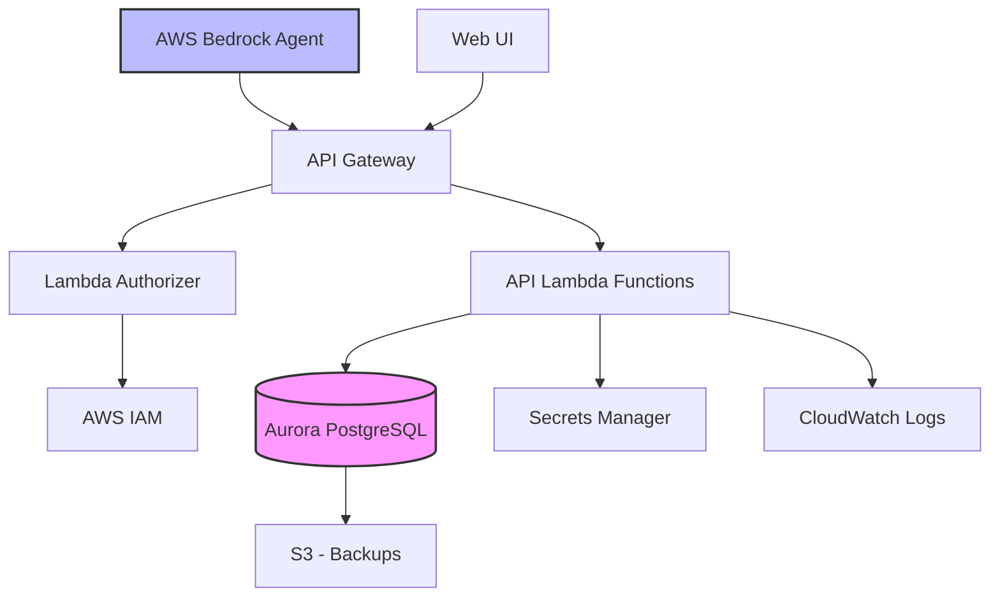
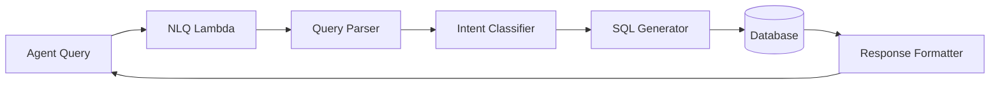
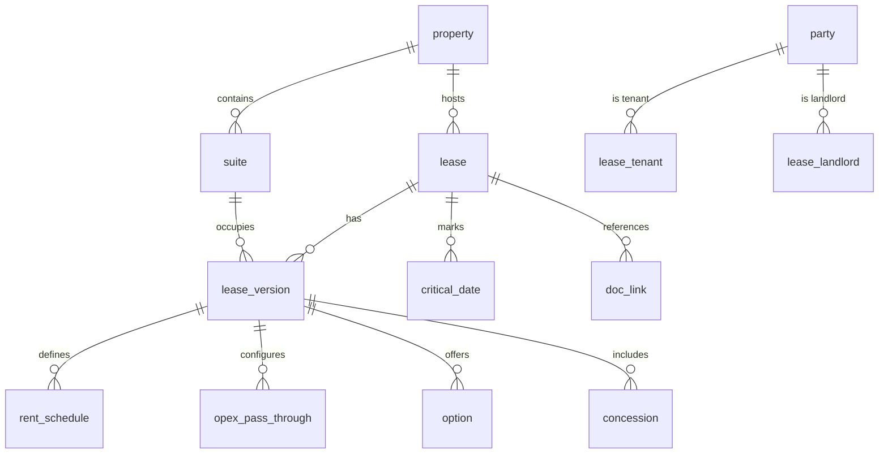

# Design Document

## Overview

The Office Lease Data Platform is a cloud-native database system built on AWS infrastructure to centralize commercial real estate lease data. The system consists of a PostgreSQL database (RDS Aurora), a REST API layer (Lambda + API Gateway), and integration points for AWS agents. The design prioritizes data integrity, query performance, and seamless integration with AWS AI services.

**Key Design Principles:**
- Data-first approach: No document storage, only structured data and external references
- Version control: Complete amendment history with single current version per lease
- Performance: Sub-second queries through strategic indexing
- AWS-native: Leverage managed services for scalability and reliability
- Agent-ready: Natural language query support for conversational AI

## Architecture

### High-Level Architecture



### Component Layers

1. **Data Layer**: Aurora PostgreSQL with 11 core tables + 9 reporting views
2. **API Layer**: Lambda functions exposing REST endpoints
3. **Authentication Layer**: IAM-based authorization with role-based access
4. **Integration Layer**: Natural language query processor for AWS agents
5. **Infrastructure Layer**: CDK-managed AWS resources

## Components and Interfaces

### 1. Database Schema

#### Core Tables

**property**
- Primary key: `property_id` (serial)
- Stores building/site information with address and total RSF
- Supports soft deletion via `active` flag

**suite**
- Primary key: `suite_id` (serial)
- Foreign key: `property_id` → property
- Unique constraint: `(property_id, suite_code)`
- Represents subdivided rentable spaces

**party**
- Primary key: `party_id` (serial)
- Stores tenants, landlords, sublandlords, guarantors
- Enum: `party_type` (TENANT, LANDLORD, SUBLANDLORD, GUARANTOR)

**lease**
- Primary key: `lease_id` (serial)
- Foreign keys: `property_id`, `landlord_id`, `tenant_id`
- Unique constraint: `(property_id, master_lease_num)`
- Contract shell linking parties and property

**lease_version**
- Primary key: `lease_version_id` (serial)
- Foreign keys: `lease_id`, `suite_id`
- Partial unique index: `(lease_id) WHERE is_current = TRUE`
- Stores amendment history with effective date ranges
- Version 0 = original lease, increments for amendments

**rent_schedule**
- Primary key: `rent_id` (serial)
- Foreign key: `lease_version_id`
- Exclusion constraint: No overlapping `period_daterange` per lease_version
- Enum: `basis` (MONTH, YEAR)

**opex_pass_through**
- Primary key: `opex_id` (serial)
- Foreign key: `lease_version_id`
- Enum: `method` (BASE_YEAR, EXPENSE_STOP, NNN, OTHER)

**option**
- Primary key: `option_id` (serial)
- Foreign key: `lease_version_id`
- Enum: `option_type` (RENEWAL, TERMINATION, EXPANSION, ROFR, OTHER)
- Uses `window_daterange` for notice period tracking

**concession**
- Primary key: `concession_id` (serial)
- Foreign key: `lease_version_id`
- Enum: `kind` (TI_ALLOWANCE, FREE_RENT, OTHER)
- Enum: `value_basis` (TOTAL, PER_SF)

**critical_date**
- Primary key: `crit_id` (serial)
- Foreign key: `lease_id`
- Enum: `kind` (COMMENCEMENT, RENT_START, EXPIRATION, NOTICE, OTHER)

**doc_link**
- Primary key: `doc_id` (serial)
- Foreign key: `lease_id`
- Stores URLs or ECM identifiers, no file storage

#### Reporting Views

All views are materialized for performance and refreshed on data changes:

1. **vw_current_lease**: Helper view joining lease + current lease_version
2. **vw_lease_expiration**: Resolves expiration date from critical_date or effective_daterange
3. **vw_expirations**: Pipeline with months_to_expiration calculation
4. **vw_rent_roll_current**: Current month rent with monthly/annual equivalents
5. **vw_options_status**: Options with notice_window_open flag
6. **vw_free_rent_status**: Active free rent with months remaining
7. **vw_ti_allowance_summary**: Aggregated TI by lease
8. **vw_critical_dates_upcoming**: 180-day lookahead
9. **vw_amendment_history**: All versions with effective ranges
10. **vw_opex_summary**: Current OpEx configurations

### 2. REST API Layer

#### API Structure

```
/api/v1
├── /properties
│   ├── GET    /           (list with filters)
│   ├── POST   /           (create)
│   ├── GET    /{id}       (detail)
│   ├── PUT    /{id}       (update)
│   └── DELETE /{id}       (soft delete)
├── /suites
├── /parties
├── /leases
│   ├── GET    /           (list with filters)
│   ├── POST   /           (create)
│   ├── GET    /{id}       (detail with versions)
│   ├── PUT    /{id}       (update)
│   └── POST   /{id}/versions (create amendment)
├── /lease-versions
├── /rent-schedules
├── /opex-pass-throughs
├── /options
├── /concessions
├── /critical-dates
├── /doc-links
├── /reports
│   ├── GET /expirations   (query params: months, state, property_id)
│   ├── GET /rent-roll     (query params: date, property_id)
│   ├── GET /options       (query params: type, window_status)
│   ├── GET /free-rent     (query params: active_only)
│   ├── GET /ti-allowances
│   ├── GET /critical-dates (query params: days_ahead)
│   ├── GET /amendments    (query params: lease_id)
│   └── GET /opex-summary
├── /batch
│   ├── POST /properties   (bulk create/update)
│   ├── POST /leases       (bulk create/update)
│   └── POST /parties      (bulk create/update)
└── /query
    └── POST /natural-language (agent queries)
```

#### Lambda Function Organization

**Single Lambda per resource type:**
- `lease-api-properties`: Handles /properties endpoints
- `lease-api-leases`: Handles /leases endpoints
- `lease-api-reports`: Handles /reports endpoints
- `lease-api-batch`: Handles /batch endpoints
- `lease-api-nlq`: Natural language query processor

**Shared Layer:**
- Database connection pooling (RDS Proxy)
- Common validation logic
- Error handling utilities
- Response formatting

### 3. Natural Language Query Processor

#### Architecture



#### Supported Query Patterns

1. **Expiration Queries**
   - "Show me leases expiring in the next 6 months"
   - "Which leases in California expire this year?"

2. **Rent Roll Queries**
   - "What's the current rent roll for Building A?"
   - "Show me all leases with monthly rent over $10,000"

3. **Options Queries**
   - "Which renewal options have open notice windows?"
   - "Show me all termination options for Tenant X"

4. **Financial Queries**
   - "What's the total TI allowance for all leases?"
   - "Show me leases with free rent ending soon"

#### Implementation Approach

- Use AWS Bedrock for intent classification
- Template-based SQL generation with parameterization
- Whitelist allowed query patterns for security
- Return structured JSON with metadata

### 4. Authentication & Authorization

#### IAM Roles

**lease_app_rw** (Service Role)
- Full CRUD access to all endpoints
- Used by application services and batch jobs
- Attached to Lambda execution roles

**analyst_ro** (User Role)
- Read-only access to /reports and GET endpoints
- No access to POST/PUT/DELETE operations
- Used by BI tools and analysts

**admin_dba** (Admin Role)
- Full access including direct database access
- Schema migration permissions
- Used by DevOps and database administrators

#### API Gateway Authorizer

- Lambda authorizer validates IAM signatures
- Extracts role from IAM principal
- Injects role into request context for Lambda functions
- Returns 403 for unauthorized access attempts

### 5. Infrastructure Components

#### AWS CDK Stack Structure

```typescript
LeaseDbStack
├── VpcStack (networking)
├── DatabaseStack (Aurora cluster)
├── ApiStack (API Gateway + Lambdas)
├── AuthStack (IAM roles + policies)
└── MonitoringStack (CloudWatch dashboards)
```

#### Database Configuration

- **Engine**: Aurora PostgreSQL 15.x (Serverless v2)
- **Instance**: db.serverless with auto-scaling (0.5-4 ACUs)
- **Storage**: Auto-scaling from 10GB
- **Backups**: Daily snapshots, 7-day retention
- **Multi-AZ**: Enabled for high availability
- **Encryption**: At-rest (KMS) and in-transit (SSL)

#### API Gateway Configuration

- **Type**: HTTP API (lower latency, lower cost)
- **Throttling**: 1000 requests/second per account
- **CORS**: Enabled for web UI
- **Logging**: Full request/response logging to CloudWatch
- **Custom Domain**: Optional with ACM certificate

## Data Models

### Entity Relationship Diagram



### Key Constraints

1. **Referential Integrity**
   - All foreign keys with ON DELETE RESTRICT
   - Prevents orphaned records

2. **Uniqueness**
   - `(property_id, suite_code)` unique
   - `(property_id, master_lease_num)` unique
   - `(lease_id) WHERE is_current = TRUE` unique (partial)

3. **Exclusion**
   - `rent_schedule.period_daterange` no overlaps per lease_version
   - Implemented with GIST index and exclusion constraint

4. **Check Constraints**
   - `party_type` IN allowed values
   - `escalation_method` IN allowed values
   - `basis` IN allowed values
   - `option_type` IN allowed values
   - `critical_kind` IN allowed values
   - `currency_code` = 'USD' (Phase 1)

### Indexing Strategy

**Primary Indexes:**
- B-tree on all primary keys (automatic)
- B-tree on all foreign keys for join performance

**Date Range Indexes:**
- GIST on `lease_version.effective_daterange`
- GIST on `rent_schedule.period_daterange`
- GIST on `option.window_daterange`
- GIST on `concession.applies_daterange`

**Partial Indexes:**
- `CREATE UNIQUE INDEX idx_current_version ON lease_version(lease_id) WHERE is_current = TRUE`

**Composite Indexes:**
- `(property_id, suite_code)` on suite
- `(property_id, master_lease_num)` on lease
- `(lease_id, kind)` on critical_date

## Error Handling

### Database Errors

**Constraint Violations:**
- Foreign key violations → 400 Bad Request with detail
- Unique violations → 409 Conflict with conflicting record ID
- Check constraint violations → 400 Bad Request with allowed values

**Connection Errors:**
- Connection timeout → 503 Service Unavailable with retry-after
- Connection pool exhausted → 503 Service Unavailable
- Query timeout → 504 Gateway Timeout

### API Errors

**Standard Error Response:**
```json
{
  "error": {
    "code": "VALIDATION_ERROR",
    "message": "Invalid lease version",
    "details": [
      {
        "field": "effective_daterange",
        "issue": "Date range overlaps with existing version"
      }
    ],
    "request_id": "abc-123-def"
  }
}
```

**Error Codes:**
- `VALIDATION_ERROR`: Input validation failed
- `NOT_FOUND`: Resource doesn't exist
- `CONFLICT`: Unique constraint violation
- `UNAUTHORIZED`: Authentication failed
- `FORBIDDEN`: Insufficient permissions
- `INTERNAL_ERROR`: Unexpected server error

### Retry Strategy

- **Transient errors**: Exponential backoff (100ms, 200ms, 400ms)
- **Rate limiting**: Respect 429 responses with retry-after header
- **Idempotency**: Support idempotency keys for POST/PUT operations

## Testing Strategy

### Unit Tests

**Database Layer:**
- Test constraint enforcement (unique, foreign key, check)
- Test trigger logic for is_current enforcement
- Test view calculations (monthly_equiv, months_to_expiration)
- Test date range overlap detection

**API Layer:**
- Test request validation
- Test response formatting
- Test error handling
- Test authorization logic

**NLQ Layer:**
- Test intent classification accuracy
- Test SQL generation for known patterns
- Test parameter sanitization

### Integration Tests

**Database Integration:**
- Test full CRUD operations on all entities
- Test cascade behavior
- Test transaction rollback scenarios
- Test concurrent updates to is_current flag

**API Integration:**
- Test end-to-end request flow
- Test authentication with IAM roles
- Test batch operations
- Test report generation with various filters

**AWS Integration:**
- Test RDS Proxy connection pooling
- Test Secrets Manager credential rotation
- Test CloudWatch log aggregation
- Test API Gateway throttling

### Load Tests

**Performance Targets:**
- 1000 concurrent users
- 95th percentile response time < 2 seconds
- Database connection pool utilization < 80%
- Lambda cold start < 1 second

**Test Scenarios:**
- Bulk lease creation (100 leases)
- Concurrent rent roll generation
- High-frequency expiration queries
- Natural language query processing

### Data Quality Tests

**Validation Rules:**
- Exactly one is_current per lease
- No orphaned lease_versions
- No overlapping rent periods
- All foreign keys resolve
- Date ranges are valid (lower < upper)

**Test Data:**
- 300 anonymized leases
- Mix of active and expired leases
- Various amendment scenarios (0-5 versions per lease)
- Edge cases (same-day periods, far-future dates)

## Deployment Strategy

### Infrastructure Deployment

**Phase 1: Foundation**
1. Deploy VPC with private subnets
2. Deploy Aurora cluster with initial schema
3. Deploy Secrets Manager with credentials
4. Deploy RDS Proxy

**Phase 2: API Layer**
1. Deploy Lambda functions with shared layer
2. Deploy API Gateway with authorizer
3. Configure CloudWatch dashboards
4. Set up alarms for errors and latency

**Phase 3: Data Migration**
1. Load anonymized test data
2. Validate data integrity
3. Refresh materialized views
4. Run smoke tests

### Database Migration Strategy

**Schema Versioning:**
- Use Flyway or Liquibase for migrations
- Store migration scripts in `/schema/migrations`
- Version format: `V{version}__{description}.sql`

**Migration Process:**
1. Run migration in transaction
2. Validate constraints
3. Rebuild indexes
4. Refresh views
5. Run data quality checks

**Rollback Plan:**
- Keep previous version snapshot
- Document rollback SQL for each migration
- Test rollback in staging environment

### Monitoring & Observability

**CloudWatch Metrics:**
- API Gateway: Request count, latency, 4xx/5xx errors
- Lambda: Invocations, duration, errors, throttles
- RDS: CPU, connections, read/write IOPS, storage
- Custom: Business metrics (leases created, reports generated)

**CloudWatch Alarms:**
- API error rate > 5% for 5 minutes
- Database CPU > 80% for 10 minutes
- Lambda errors > 10 in 5 minutes
- Database connections > 90% of max

**Logging Strategy:**
- Structured JSON logs
- Correlation IDs across services
- Log retention: 30 days for API, 7 days for database
- Sensitive data redaction (no PII in logs)

## Security Considerations

### Data Protection

**Encryption:**
- At-rest: KMS encryption for RDS and S3
- In-transit: TLS 1.2+ for all connections
- Secrets: Stored in Secrets Manager, rotated every 90 days

**Network Security:**
- Database in private subnets only
- Security groups restrict access to Lambda functions
- No public internet access to database
- VPC endpoints for AWS services

### Access Control

**Principle of Least Privilege:**
- Lambda execution roles have minimal permissions
- Database users mapped to specific roles
- API Gateway authorizer enforces role-based access
- CloudWatch logs encrypted with KMS

**Audit Logging:**
- All API requests logged with IAM principal
- Database audit log for DDL/DML operations
- Failed authentication attempts logged
- Quarterly access review process

### Compliance

**Data Classification:**
- Business confidential (no PII in Phase 1)
- Financial data (rent amounts, TI allowances)
- Contract metadata (dates, terms)

**Retention Policy:**
- Active leases: Indefinite retention
- Expired leases: 7 years post-expiration
- Audit logs: 1 year retention
- Backups: 7 days retention

## Performance Optimization

### Query Optimization

**Materialized Views:**
- Refresh on data change via triggers
- Concurrent refresh to avoid locking
- Indexed on commonly filtered columns

**Connection Pooling:**
- RDS Proxy with 100 max connections
- Lambda reuses connections across invocations
- Connection timeout: 30 seconds

**Caching Strategy:**
- API Gateway caching for report endpoints (5 minutes TTL)
- Lambda layer caching for reference data
- No caching for real-time data (current rent roll)

### Scalability

**Database Scaling:**
- Aurora Serverless v2 auto-scales ACUs
- Read replicas for report queries (future)
- Partition large tables by date (future)

**API Scaling:**
- Lambda auto-scales to 1000 concurrent executions
- API Gateway handles 10,000 requests/second
- CloudFront CDN for static assets (future)

## Future Enhancements

**Phase 2 Considerations:**
- Document storage in S3 with metadata in database
- CPI automation with external data feeds
- Sublease tracking with hierarchical relationships
- Multi-currency support
- Advanced analytics with QuickSight

**Agent Capabilities:**
- Proactive expiration notifications
- Automated rent roll generation
- Lease comparison and analysis
- Anomaly detection in rent schedules
- Predictive analytics for renewals
